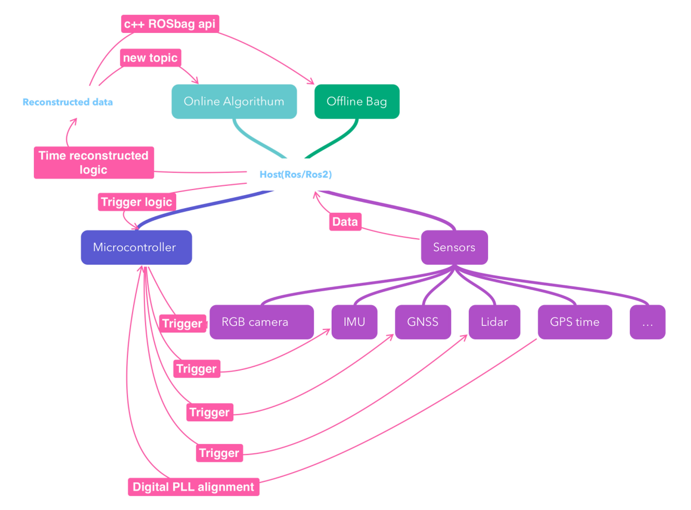
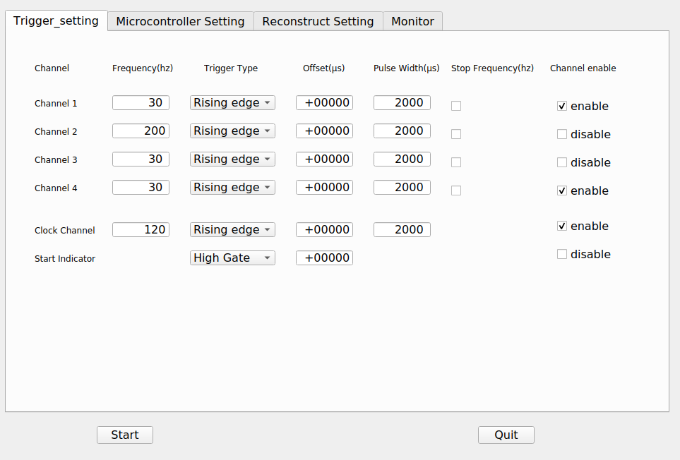
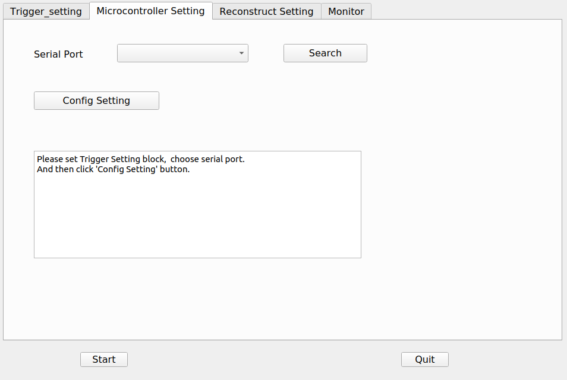
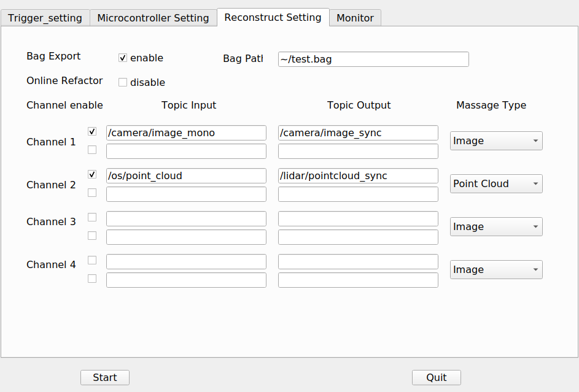
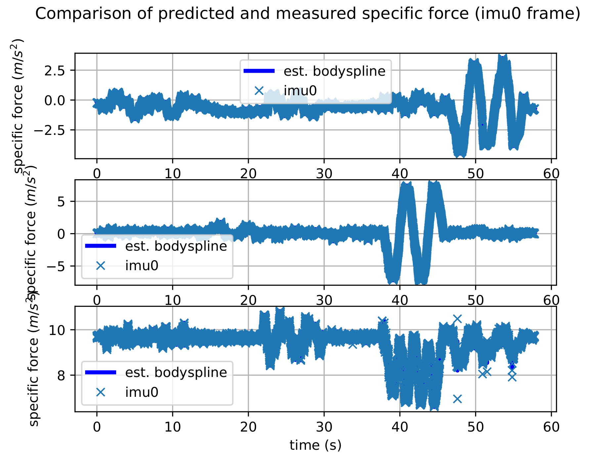
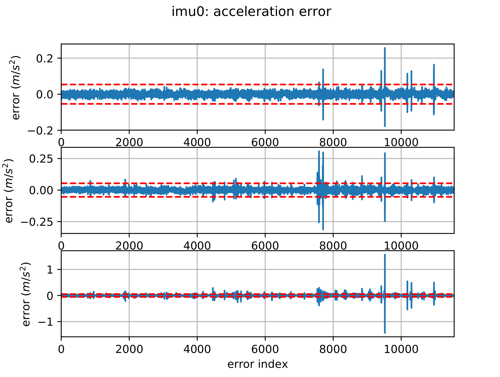
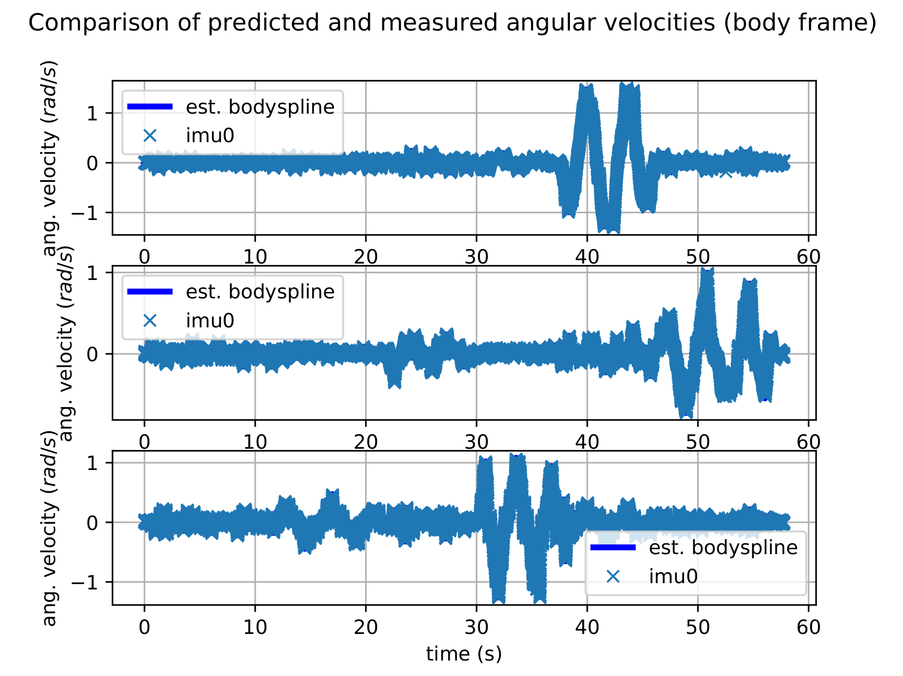
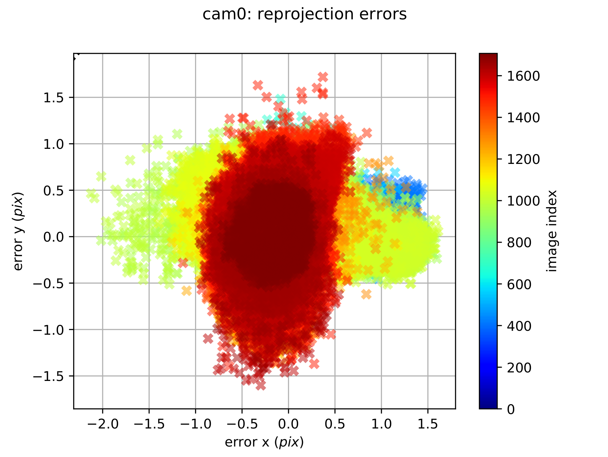
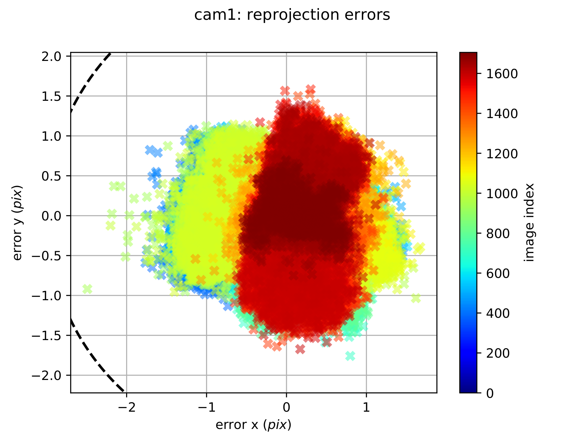

# Synchronization toolbox


An open-source toolbox for users to have easy access to Hardware Synchronization on multi-sensors. The toolbox has a GUI based on QT (RQT). Users can record a ROS bag or have a new topic reflector  (reconstructed timestamp) as they want. Furthermore, the hardware-level IMU data process is also embedded in Microcontroller.

## 

## INSTALLATION

#### Host installation

Environment(Host): Ubuntu 20.04(ros-noetic)

```sh
sudo apt-get install libqt5serialport5-dev
mkdir -p ~/catkin_ws/src && cd ~/catkin_ws/src
git clone git@github.com:sjtuyuxuan/sync_toolbox.git
cd ~/catkin_ws && catkin_make
source ~/catkin_ws/devel/setup.bash
```

#### Microcontroller installation:

##### NU-32

First, connect the boot loader line and set the PIC-32 to boot loader mode.

Second, find the serial port name (usually is `/dev/ttyUSB0`)

Third, set the makefile MACRO (more detail in 'http://hades.mech.northwestern.edu/index.php/ME_333_Introduction_to_Mechatronics')

Forth, run the commend

```sh
make write
```

##### STM32-F103C8T6

TBD

###

## How to use it

### Step 1 : Set trigger logic



There are 4 general channel + 1 clock channel + 1 start indicate channel.

##### General channel

General sensor trigger channel have three mode raising edge, falling edge, and double edge mode. 

Frequency is from 1 - 999 Hz

Offset is in unit of us, which can be positive (later than standard time) or negative.

Pulse width is also in unit of us. Notice that it is disabled when double edge mode is checked.

General channel is started synchronized when the `start` button is clicked.

##### Clock channel

Clock channel channel is similar to General channel but start when the microcontroller is set.

The channel is usually used as a clock reference.

##### Start indicator channel

Start indicator channel is used together with clock channel to mark the start and end signal to other device.

There is high gate, low gate, and double pulse mode.  

### Step 2 : Send setting to microcontroller



First, click search button and find the correct serial port for microcontroller.

Second, click the config setting button.

###  Step 3 : Set the timestamp reconstruction



There are two ways to use the timestamps reconstruction: Bag export and online reflector.

Each General channel have two topic could be reconstructed independently (stereo case).

There are four default massage type. <Image>, <Point Cloud>, <Imu>, and <PoseStamped>.

The massage content will not changed. Only the `header` will changed.

### Step 4 : Enjoy the data

Click the start button and start recording data.

## Sample Usage with Test

### Sensor:

1. 2xGrasshopper usb3 camera (1224x1024, 30Hz, global shutter)
2. XSense Mti300 IMU (9-axis, 200Hz)
3. Motion Capture System

### Data visualizer 


### Result

```c++
cam0:

T_cam_imu:

\- [0.017248643674008135, -0.9998037138739959, 0.009747718459772736, 0.07733078169916466]

\- [0.012834636469124028, -0.009526963092989282, -0.999872246379971, -0.016637889364465353]

\- [0.9997688514842376, 0.017371548520172697, 0.01266779001636642, -0.14481844113148515]

\- [0.0, 0.0, 0.0, 1.0]

camera_model: pinhole

distortion_coeffs: [-0.31576, 0.104955, 0.00032, -0.000156]

distortion_model: radtan

intrinsics: [886.191073, 886.591633, 610.578911, 514.59271]

resolution: [1224, 1024]

rostopic: /stereo/left/image_mono

**timeshift_cam_imu: 0.005375665182111344**
```


****

```c++
cam1:

T_cam_imu:

\- [0.014447870885660574, -0.9997787221387724, -0.015289401081614196, -0.09375829054484337]

\- [0.01108843210124949, 0.015450259055501236, -0.9998191517312787, -0.015076213124111792]

\- [0.9998341390952836, 0.014275722527461954, 0.011309201824693582, -0.14050229888646543]

\- [0.0, 0.0, 0.0, 1.0]

camera_model: pinhole

distortion_coeffs: [-0.311523, 0.09641, 0.000623, -0.000375]

distortion_model: radtan

intrinsics: [887.804282, 888.04815, 616.177573, 514.712952]

resolution: [1224, 1024]

rostopic: /stereo/right/image_mono

**timeshift_cam_imu: 0.005415704144667583**
```

The timeshift from camera and imu is near 5ms which is in line with our expectations. Because we set start point aligned and the exposure time is 10ms.












